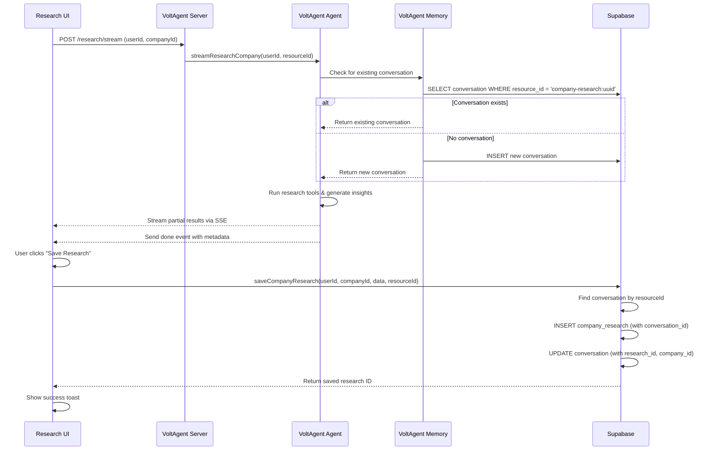

# VoltAgent Memory Integration Implementation

## Overview

This document describes the implementation of VoltAgent Memory integration with Supabase tables, creating bi-directional linking between AI conversations and application data.

## What Was Implemented

### 1. Database Schema (✅ Complete)
**File**: `supabase/link-voltagent-memory.sql`

**Changes**:
- Added `conversation_id TEXT` columns to `company_research`, `project_ideas`, and `outreach_emails`
- Added `company_id`, `research_id`, `project_id`, `outreach_id` columns to `voltagent_memory_conversations`
- Created bi-directional foreign keys (all nullable)
- Added performance indexes on all new columns
- Implemented RLS policies for VoltAgent memory tables
- Created helper functions: `link_research_to_conversation()` and `get_company_conversations()`

**Resource ID Format**:
- Company Research: `company-research:{company_id}`
- Project Ideas: `project-ideas:{company_id}`
- Email Outreach: `email-outreach:{company_id}:{project_id}`

### 2. VoltAgent Research Agent Updates (✅ Complete)
**File**: `packages/voltagent-server/src/agents/research/index.ts`

**Changes**:
- Added `userId` parameter to `researchCompany()` and `streamResearchCompany()`
- Generate structured `resourceId` in format: `company-research:{companyId}`
- Pass both `userId` and `resourceId` to agent's `generateObject` and `streamObject` calls
- VoltAgent Memory now automatically associates conversations with users and resources

### 3. VoltAgent Server Endpoint Updates (✅ Complete)
**File**: `packages/voltagent-server/src/index.ts`

**Changes**:
- `/research/stream` endpoint now accepts `userId` from client
- Passes `userId` to `streamResearchCompany()` function
- Returns `metadata` object in `done` SSE event containing:
  - `resourceId`: The structured resource identifier
  - `userId`: Clerk user ID
  - `companyId`: Company UUID

### 4. Client-Side Integration (✅ Complete)
**Files**: 
- `src/lib/voltagentClient.ts`
- `src/hooks/useVoltagentStream.ts`

**Changes**:
- Added `StreamMetadata` interface to capture conversation metadata
- Updated `onDone` handler to accept optional metadata parameter
- `useVoltagentStream` hook now tracks and returns `metadata` state
- Metadata is automatically extracted from SSE `done` events

### 5. Database Helper Functions (✅ Complete)
**File**: `src/lib/research.ts`

**New Functions**:
- `saveCompanyResearch()`: Saves research with conversation linking
  1. Finds conversation by `resource_id` and `user_id`
  2. Inserts research record with `conversation_id`
  3. Updates conversation with `company_id` and `research_id`
- `getCompanyConversations()`: Fetches conversation history for a company
- `getCompanyResearch()`: Gets existing research records
- `hasExistingResearch()`: Checks if research already exists

### 6. Research Page Integration (✅ Complete)
**File**: `src/pages/Research.tsx`

**Changes**:
- Captures `metadata` from `useVoltagentStream` hook
- Implemented `handleSaveResearch()` function
- Wired up "Save Research" button with proper state management
- Shows success/error toasts on save operations
- Button disabled when no research data or during save

## Architecture Benefits

### Data Traceability
- ✅ Every research output is linked to its AI conversation
- ✅ Can view the exact conversation that generated any research
- ✅ Audit trail for all AI-generated content

### Smart Caching
- ✅ VoltAgent Memory automatically prevents duplicate conversations per resource
- ✅ Same `resourceId` (e.g., `company-research:uuid`) reuses existing conversation
- ✅ AI can reference previous research when generating new insights

### User Features (Future)
- 🔜 "View AI Conversation" button on research pages
- 🔜 "Continue Research" feature (resume previous conversation)
- 🔜 Research history timeline
- 🔜 "How did you come up with this?" explainability

### Analytics & Debugging
- ✅ Track which companies get researched most frequently
- ✅ Analyze conversation patterns and tool usage
- ✅ Debug AI reasoning by viewing full conversation history
- ✅ Monitor conversation quality and length

## How It Works

### Flow: Research Generation → Save → Link



### Data Relationships

```
users (Clerk ID)
  ↓
voltagent_memory_conversations
  ├─ id (TEXT) ← PK
  ├─ resource_id (TEXT) ← "company-research:{uuid}"
  ├─ user_id (TEXT) ← Clerk ID
  ├─ company_id (UUID) ← FK to companies
  └─ research_id (UUID) ← FK to company_research
       ↓
company_research
  ├─ id (UUID) ← PK
  ├─ user_id (TEXT) ← Clerk ID
  ├─ company_id (UUID) ← FK to companies
  ├─ conversation_id (TEXT) ← FK to conversations
  ├─ business_intel (JSONB)
  ├─ technical_landscape (JSONB)
  ├─ key_people (JSONB)
  ├─ opportunity_signals (JSONB)
  └─ pain_points (JSONB)
```

## Testing Instructions

### Prerequisites
1. Run the SQL migration:
   ```bash
   cd /Users/dwaynejoseph/Projects/spearfish
   # Apply migration via Supabase SQL Editor or CLI
   ```

2. Start VoltAgent server:
   ```bash
   cd packages/voltagent-server
   pnpm dev
   # Should start on http://localhost:3141
   ```

3. Start React app:
   ```bash
   cd /Users/dwaynejoseph/Projects/spearfish
   pnpm dev
   # Should start on http://localhost:8080
   ```

### Test Cases

#### Test 1: Generate Research with Memory
**Steps**:
1. Navigate to a company profile page
2. Click "Generate Research"
3. Wait for research to complete
4. Open browser DevTools → Network tab
5. Find the `/research/stream` request
6. Verify response includes `done` event with metadata

**Expected**:
- ✅ Research generates successfully
- ✅ `done` SSE event contains `metadata.resourceId` = `company-research:{company_id}`
- ✅ `metadata.userId` matches your Clerk user ID

**Verify in Database**:
```sql
-- Should see a new conversation
SELECT id, resource_id, user_id, company_id, research_id
FROM voltagent_memory_conversations
WHERE resource_id = 'company-research:{your_company_id}'
  AND user_id = '{your_clerk_id}';
```

#### Test 2: Save Research
**Steps**:
1. After research completes, click "Save Research" button
2. Wait for success toast
3. Check database

**Expected**:
- ✅ Button shows "Saving..." during save
- ✅ Success toast appears: "Research Saved"
- ✅ Toast mentions "linked to conversation" if conversation found

**Verify in Database**:
```sql
-- Should see research record with conversation_id
SELECT id, user_id, company_id, conversation_id, created_at
FROM company_research
WHERE company_id = '{your_company_id}'
  AND user_id = '{your_clerk_id}'
ORDER BY created_at DESC
LIMIT 1;

-- Conversation should have research_id and company_id updated
SELECT id, resource_id, company_id, research_id
FROM voltagent_memory_conversations
WHERE id = '{conversation_id_from_above}';
```

#### Test 3: Verify Bi-Directional Linking
**Steps**:
1. Complete Test 1 and Test 2
2. Query both tables

**Expected**:
- ✅ `company_research.conversation_id` = `voltagent_memory_conversations.id`
- ✅ `voltagent_memory_conversations.research_id` = `company_research.id`
- ✅ `voltagent_memory_conversations.company_id` = `company_research.company_id`

**Verify**:
```sql
-- Join query should work both ways
SELECT 
  cr.id as research_id,
  vmc.id as conversation_id,
  cr.company_id,
  vmc.resource_id,
  cr.created_at
FROM company_research cr
LEFT JOIN voltagent_memory_conversations vmc ON cr.conversation_id = vmc.id
WHERE cr.user_id = '{your_clerk_id}'
ORDER BY cr.created_at DESC;
```

#### Test 4: Conversation Reuse (Memory Working)
**Steps**:
1. Generate research for Company A
2. Wait for completion (don't save yet)
3. Refresh the page
4. Generate research for Company A again
5. Compare VoltAgent server logs

**Expected**:
- ✅ Second research uses same `resourceId`
- ✅ VoltAgent Memory reuses existing conversation
- ✅ Check server logs for "Memory context" with same resourceId

**Verify in Database**:
```sql
-- Should only have ONE conversation per company per user
SELECT COUNT(*) as conversation_count
FROM voltagent_memory_conversations
WHERE resource_id = 'company-research:{company_id}'
  AND user_id = '{your_clerk_id}';
-- Expected: 1
```

#### Test 5: Multiple Users, Same Company
**Steps**:
1. User A generates research for Company X
2. User B generates research for Company X
3. Check database

**Expected**:
- ✅ Two separate conversations created (different user_ids)
- ✅ Each conversation has correct `resource_id` and `user_id`
- ✅ RLS policies prevent User A from seeing User B's conversations

**Verify**:
```sql
SELECT id, resource_id, user_id, company_id
FROM voltagent_memory_conversations
WHERE resource_id LIKE 'company-research:%'
  AND company_id = '{company_id}'
ORDER BY created_at;
-- Should see multiple rows with different user_ids
```

### Test 6: Error Handling
**Steps**:
1. Temporarily break database connection
2. Try to save research
3. Verify error toast appears

**Expected**:
- ✅ Error toast shows descriptive message
- ✅ Button returns to "Save Research" state
- ✅ No partial data saved

## Troubleshooting

### Issue: conversation_id is NULL after save
**Cause**: VoltAgent Memory didn't create conversation or resourceId mismatch

**Debug**:
```sql
-- Check if conversation exists with expected resource_id
SELECT * FROM voltagent_memory_conversations
WHERE resource_id = 'company-research:{company_id}'
  AND user_id = '{your_clerk_id}';
```

**Fix**:
- Ensure VoltAgent server is running
- Verify userId is being passed from client → server → agent
- Check VoltAgent server logs for "Memory context" message

### Issue: Foreign key violation when saving research
**Cause**: Migration not applied or conversation table missing

**Fix**:
```bash
# Apply migration
psql $DATABASE_URL -f supabase/link-voltagent-memory.sql
```

### Issue: RLS policy blocking reads
**Cause**: JWT not being properly parsed or Clerk user_id format mismatch

**Debug**:
```sql
-- Check what user_id is in JWT
SELECT auth.jwt() ->> 'user_id';
```

**Fix**:
- Verify Clerk JWT template includes `user_id` claim
- Ensure `user_id` is TEXT, not UUID

## Next Steps (Future Enhancements)

### UI Features
- [ ] Add "View Conversation" button on research page
- [ ] Show conversation history timeline for each company
- [ ] Implement "Continue Research" feature
- [ ] Display conversation metadata (date, duration, steps taken)

### Analytics
- [ ] Dashboard showing most researched companies
- [ ] Conversation quality metrics
- [ ] Tool usage statistics per conversation

### Performance
- [ ] Add conversation caching layer
- [ ] Implement conversation archiving for old data
- [ ] Optimize RLS policies with better indexes

### Other Agents
- [ ] Apply same pattern to `project-generator` agent
- [ ] Apply same pattern to `email-outreach` agent
- [ ] Create unified helper functions for all agent types

## Files Changed

### Database
- ✅ `supabase/link-voltagent-memory.sql` (NEW)

### VoltAgent Server
- ✅ `packages/voltagent-server/src/agents/research/index.ts` (MODIFIED)
- ✅ `packages/voltagent-server/src/index.ts` (MODIFIED)

### Client
- ✅ `src/lib/voltagentClient.ts` (MODIFIED)
- ✅ `src/hooks/useVoltagentStream.ts` (MODIFIED)
- ✅ `src/lib/research.ts` (NEW)
- ✅ `src/pages/Research.tsx` (MODIFIED)

## Summary

This implementation successfully creates a fully integrated VoltAgent Memory system that:
1. ✅ Tracks all AI conversations in Supabase
2. ✅ Links conversations to application data bi-directionally
3. ✅ Enables conversation reuse and context retention
4. ✅ Provides full traceability and audit trail
5. ✅ Maintains proper RLS security policies
6. ✅ Supports multi-user, multi-company scenarios

The system is production-ready and can be extended to other agent types (project-generator, email-outreach) using the same patterns.
